# Rede+ — Microajudas entre Vizinhos

<p align="center">
  
</p>

<p align="center">
  <strong>Conectando vizinhos. Facilitando ajudas.</strong>
</p>

<p align="center">
  Aplicativo mobile desenvolvido em Flutter/Dart para conectar pessoas próximas por meio de pequenas ajudas do dia a dia.
</p>

---

## Sobre o projeto

O **Rede+** é uma plataforma de microajudas entre moradores de uma mesma região.

A proposta é resolver um problema simples e recorrente:

> **Quem precisa não sabe quem pode ajudar. Quem pode ajudar não sabe que alguém precisa.**

O aplicativo permite que uma pessoa publique uma necessidade e que outros usuários próximos encontrem esse pedido, se ofereçam para ajudar e acompanhem o andamento da ajuda.

O projeto foi desenvolvido na **FIAP**, na disciplina de **Cross-Platform Application Development**, utilizando **Flutter, Dart e Firebase**.

---

## Repositórios

### Projeto atual

Repositório principal, contendo a versão funcional do Rede+:

[github.com/jalbino0/Rede-Mais](https://github.com/jalbino0/Rede-Mais)

### CP4 — versão Beta

Repositório correspondente à etapa inicial do projeto, com conceito, identidade visual, Design System e primeira versão da interface:

[github.com/jalbino0/Rede-Mais-Beta](https://github.com/jalbino0/Rede-Mais-Beta)

---

## Evolução do projeto

```text
CP4
↓
Conceito + identidade visual + Design System + primeira Home
↓
Versão atual
↓
Autenticação + Firebase + pedidos + ofertas de ajuda
+ localização por CEP + raio de 3 km + APK de release
```

A versão atual representa a evolução da ideia inicial para um **MVP funcional**, com persistência real de dados e fluxos completos de uso.

---

## Problema

Pequenas necessidades do cotidiano normalmente dependem de grupos informais, contatos pessoais ou aplicativos que não foram criados especificamente para colaboração entre vizinhos.

Isso dificulta situações como:

- encontrar alguém próximo disponível para ajudar;
- pedir pequenas ajudas de forma organizada;
- descobrir oportunidades de ajudar outras pessoas;
- acompanhar o andamento de uma ajuda;
- criar relações de colaboração dentro da comunidade.

O Rede+ centraliza esse processo em uma experiência simples e focada em proximidade.

---

## Proposta de valor

> **Facilitar a interação de ajuda local e fortalecer a colaboração entre moradores de uma mesma região.**

A plataforma transforma proximidade em colaboração, permitindo que pessoas próximas se conectem para resolver pequenas necessidades do cotidiano.

---

## Público-alvo

O Rede+ é destinado a moradores de uma mesma região, abrangendo diferentes perfis e faixas etárias.

O objetivo não é restringir a plataforma a um grupo específico, mas permitir que qualquer pessoa da comunidade possa:

- solicitar ajuda;
- oferecer ajuda;
- acompanhar seus pedidos;
- acompanhar ajudas em andamento.

---

# Funcionalidades implementadas

## Autenticação

- criação de conta;
- login com e-mail e senha;
- logout;
- recuperação de senha por e-mail;
- persistência da sessão com Firebase Authentication.

## Perfil

- nome do usuário;
- e-mail;
- CEP;
- edição de nome e localização;
- atualização dos dados relacionados ao usuário.

## Localização e privacidade

O Rede+ utiliza o **CEP** para obter uma localização aproximada.

A partir dessa informação são armazenadas coordenadas de latitude e longitude para cálculo de proximidade.

O aplicativo:

- não exibe o CEP publicamente;
- não exibe endereço exato;
- mostra apenas a região/bairro do pedido;
- utiliza um raio de até **3 km** para descoberta de pedidos próximos.

A distância é calculada a partir das coordenadas do usuário e do pedido.

## Pedidos de ajuda

O usuário pode:

- criar um pedido;
- escolher uma categoria;
- adicionar título e descrição;
- marcar um pedido como urgente;
- visualizar o bairro aproximado;
- editar seus pedidos;
- acompanhar o status;
- excluir pedidos;
- finalizar uma ajuda.

## Ofertas de ajuda

Outro usuário pode:

- encontrar pedidos próximos;
- abrir os detalhes do pedido;
- se oferecer para ajudar;
- acompanhar a oferta;
- ser aceito pelo responsável pelo pedido;
- acompanhar a ajuda em andamento;
- visualizar quando a ajuda for finalizada.

## Descoberta por proximidade

As telas **Home** e **Explorar** mostram pedidos ativos de outras pessoas dentro de um raio de até **3 km**.

Pedidos fora desse raio não são exibidos.

## Categorias

Os pedidos são organizados nas seguintes categorias:

- Mercado
- Pet
- Transporte
- Casa
- Tecnologia
- Companhia
- Outros

---

# Fluxo principal

```text
Usuário cria uma conta
        ↓
CEP é convertido em localização aproximada
        ↓
Usuário publica um pedido
        ↓
Pedido é salvo no Cloud Firestore
        ↓
Outros usuários em até 3 km podem encontrá-lo
        ↓
Outro usuário se oferece para ajudar
        ↓
Responsável pelo pedido aceita a ajuda
        ↓
Pedido passa para "Em andamento"
        ↓
Ajuda é realizada
        ↓
Responsável finaliza o pedido
        ↓
Pedido passa para "Finalizado"
```

---

# Telas do aplicativo

## Autenticação

<table>
  <tr>
    <td align="center">
      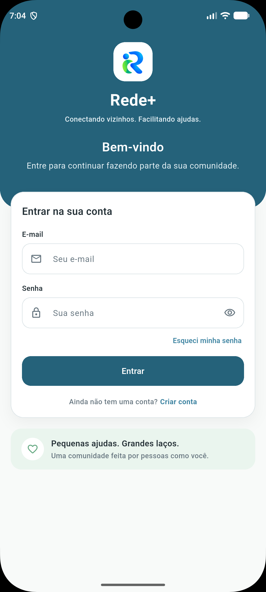<br>
      <strong>Login</strong>
    </td>
    <td align="center">
      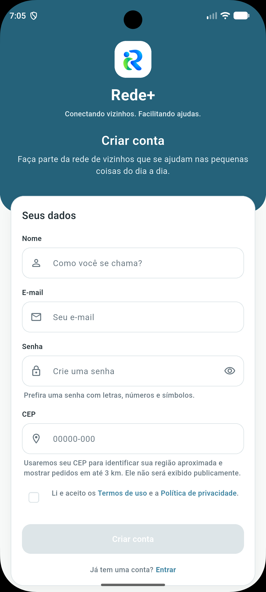<br>
      <strong>Criar conta</strong>
    </td>
  </tr>
</table>

## Home e descoberta

<table>
  <tr>
    <td align="center">
      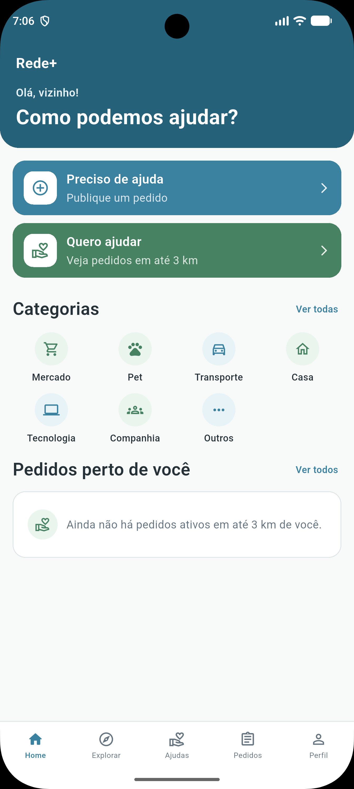<br>
      <strong>Home</strong>
    </td>
    <td align="center">
      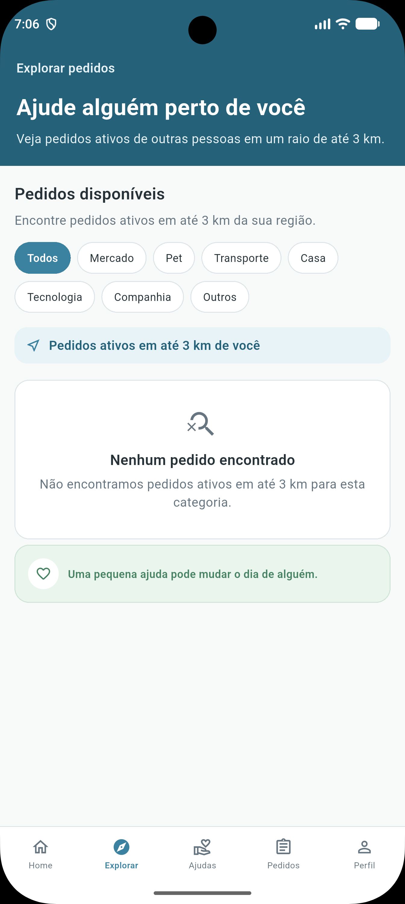<br>
      <strong>Explorar</strong>
    </td>
    <td align="center">
      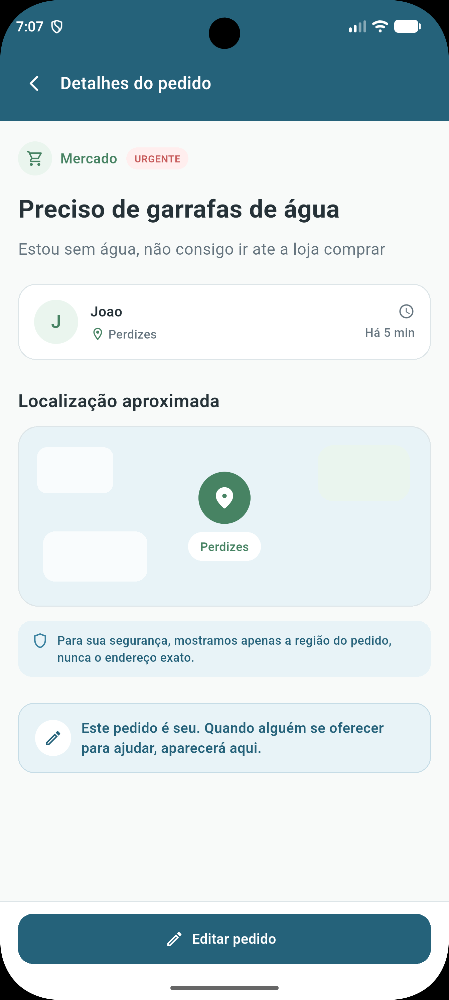<br>
      <strong>Detalhes do pedido</strong>
    </td>
  </tr>
</table>

## Publicação de pedido

<table>
  <tr>
    <td align="center">
      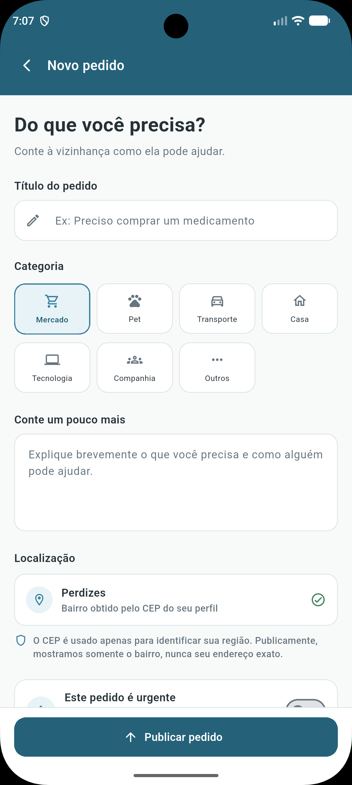<br>
      <strong>Novo pedido</strong>
    </td>
    <td align="center">
      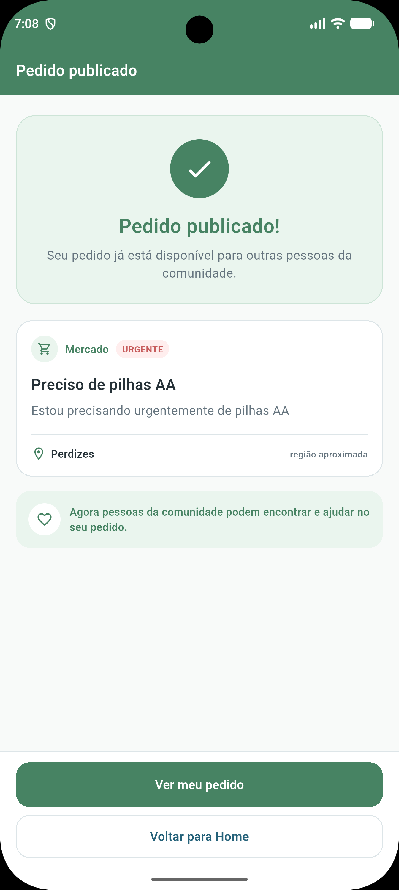<br>
      <strong>Pedido publicado</strong>
    </td>
  </tr>
</table>

## Acompanhamento

<table>
  <tr>
    <td align="center">
      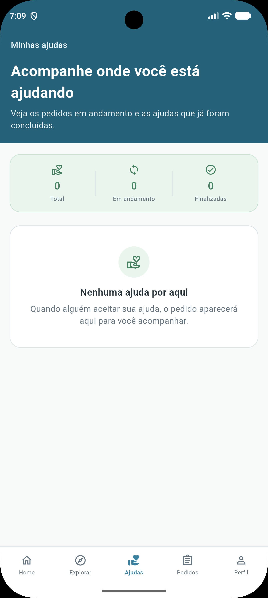<br>
      <strong>Ajudas</strong>
    </td>
    <td align="center">
      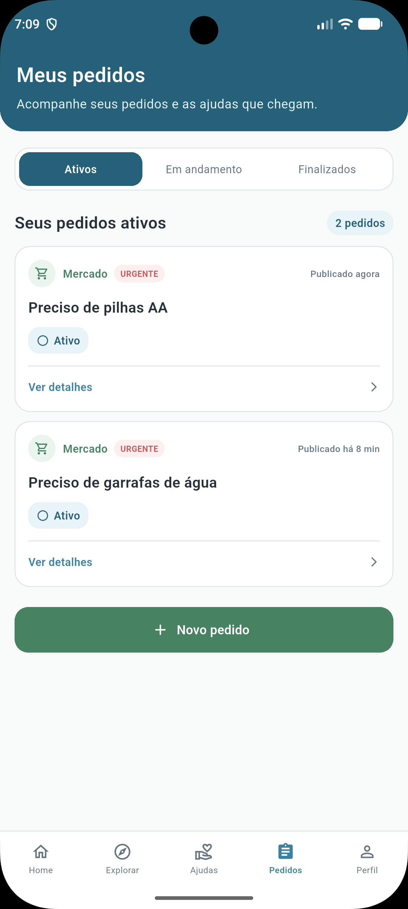<br>
      <strong>Meus pedidos</strong>
    </td>
  </tr>
</table>

## Perfil

<table>
  <tr>
    <td align="center">
      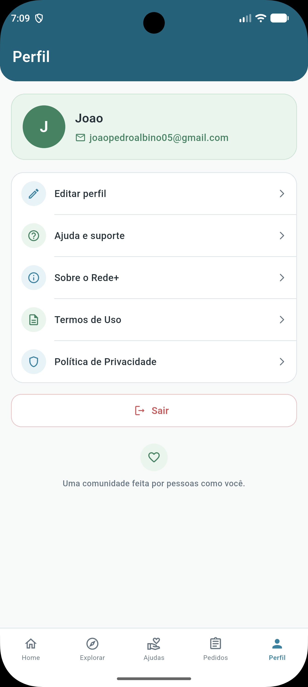<br>
      <strong>Perfil</strong>
    </td>
    <td align="center">
      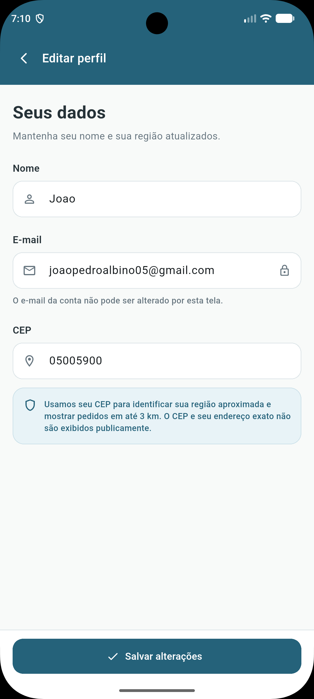<br>
      <strong>Editar perfil</strong>
    </td>
  </tr>
</table>

---

# Identidade da marca

## Nome

**Rede+**

O nome representa dois conceitos principais:

**Rede**

- conexão;
- comunidade;
- proximidade;
- colaboração.

**+**

- ajuda;
- cooperação;
- impacto positivo;
- algo sendo acrescentado à comunidade.

---

## Slogan

> **Conectando vizinhos. Facilitando ajudas.**

O slogan resume a proposta central do aplicativo: aproximar pessoas que vivem próximas e tornar pequenas ajudas do cotidiano mais acessíveis.

---

## Conceito visual

A identidade visual representa duas pessoas se conectando e formando visualmente a letra **R**, simbolizando colaboração, comunidade e ajuda mútua.

<p align="center">
  
</p>

A marca busca transmitir:

**confiança + humanidade + tranquilidade**

---

# Design System

## Paleta de cores

<p align="center">
  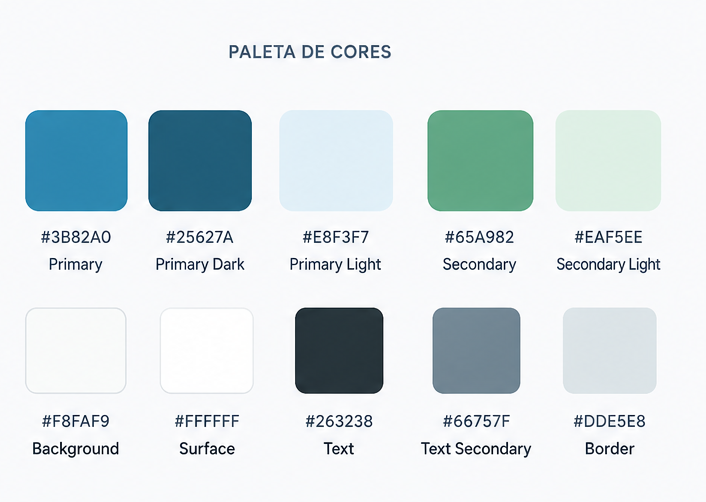
</p>

| Função | Cor | Hex |
|---|---|---|
| Primary | Azul comunidade | `#3B82A0` |
| Primary Dark | Azul profundo | `#25627A` |
| Primary Light | Azul suave | `#E8F3F7` |
| Secondary | Verde colaboração | `#65A982` |
| Secondary Dark | Verde profundo | `#478363` |
| Secondary Light | Verde suave | `#EAF5EE` |
| Background | Off-white | `#F8FAF9` |
| Surface | Branco | `#FFFFFF` |
| Text | Cinza escuro | `#263238` |
| Text Secondary | Cinza | `#66757F` |
| Border | Cinza claro | `#DDE5E8` |
| Danger | Vermelho suave | `#C75C5C` |
| Danger Light | Vermelho claro | `#FFEEEE` |

---

## Tipografia

A tipografia utilizada é a **Inter**.

| Estilo | Tamanho | Peso |
|---|---:|---|
| Display | 32 px | Bold |
| H1 | 28 px | Bold |
| H2 | 22 px | SemiBold |
| H3 | 18 px | SemiBold |
| Body | 16 px | Regular |
| Small | 14 px | Regular |
| Caption | 12 px | Medium |

Os arquivos da fonte estão em:

```text
assets/fonts/
```

---

## Iconografia

A iconografia segue o estilo **outline/stroke**, mantendo aparência simples, consistente e de fácil identificação.

<p align="center">
  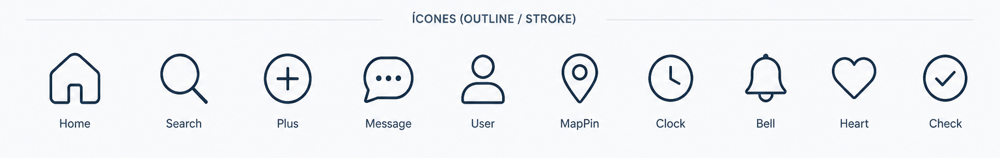
</p>

---

# Tecnologias utilizadas

- **Flutter** — desenvolvimento da aplicação mobile;
- **Dart** — linguagem principal;
- **Firebase Authentication** — autenticação e recuperação de senha;
- **Cloud Firestore** — persistência dos usuários, pedidos e ofertas de ajuda;
- **BrasilAPI** — consulta de CEP e coordenadas;
- **ViaCEP** — fallback para consulta de CEP;
- **Material Design** — base dos componentes visuais;
- **Git** — controle de versão;
- **GitHub** — hospedagem do código e documentação;
- **Android SDK** — compilação, testes e geração do APK.

---

# Arquitetura

A aplicação foi organizada separando interface, modelos, serviços e integração com Firebase.

```text
Flutter
│
├── Screens
├── Models
├── Services
│   ├── AuthService
│   ├── UserService
│   ├── RequestService
│   ├── HelpOfferService
│   ├── CepService
│   └── DistanceService
│
└── Firebase
    ├── Authentication
    └── Cloud Firestore
```

---

# Estrutura do projeto

```text
rede_mais/
│
├── android/
├── assets/
│   ├── fonts/
│   │   ├── Inter-Bold.ttf
│   │   ├── Inter-Medium.ttf
│   │   ├── Inter-Regular.ttf
│   │   └── Inter-SemiBold.ttf
│   │
│   └── images/
│       ├── icone_app.png
│       ├── logo.png
│       └── logo_simplificada.png
│
├── design/
│   ├── ajudas.png
│   ├── criar-conta.png
│   ├── detalhes-pedido.png
│   ├── editar-perfil.png
│   ├── explorar.png
│   ├── home.png
│   ├── login.png
│   ├── meus-pedidos.png
│   ├── novo-pedido.png
│   ├── pedido-publicado.png
│   ├── perfil.png
│   ├── logo-principal.png
│   ├── paleta-de-cores.png
│   ├── icones-do-app.png
│   ├── ideias-de-icones.png
│   └── icones-categorias.png
│
├── lib/
│   ├── models/
│   │   └── help_request.dart
│   │
│   ├── screens/
│   │   ├── create_account_screen.dart
│   │   ├── create_request_screen.dart
│   │   ├── edit_profile_screen.dart
│   │   ├── explore_screen.dart
│   │   ├── home_screen.dart
│   │   ├── login_screen.dart
│   │   ├── my_helps_screen.dart
│   │   ├── my_requests_screen.dart
│   │   ├── privacy_policy_screen.dart
│   │   ├── profile_screen.dart
│   │   ├── request_details_screen.dart
│   │   ├── request_published_screen.dart
│   │   └── terms_of_use_screen.dart
│   │
│   ├── services/
│   │   ├── auth_service.dart
│   │   ├── cep_service.dart
│   │   ├── distance_service.dart
│   │   ├── help_offer_service.dart
│   │   ├── request_service.dart
│   │   └── user_service.dart
│   │
│   ├── theme/
│   │   ├── app_colors.dart
│   │   └── app_text_styles.dart
│   │
│   ├── widgets/
│   │   └── main_navigation.dart
│   │
│   ├── firebase_options.dart
│   └── main.dart
│
├── test/
│   └── widget_test.dart
│
├── flutter_launcher_icons.yaml
├── pubspec.yaml
└── README.md
```

---

# Firebase

## Authentication

O Firebase Authentication é utilizado para:

- criar contas;
- autenticar usuários;
- manter a sessão;
- sair da conta;
- enviar e-mails de recuperação de senha.

## Cloud Firestore

O banco de dados utiliza três coleções principais:

```text
users/
requests/
helpOffers/
```

### `users`

Armazena informações privadas do usuário, como:

```text
name
email
cep
latitude
longitude
createdAt
updatedAt
```

### `requests`

Armazena os pedidos de ajuda:

```text
userId
userName
title
description
category
neighborhood
latitude
longitude
isUrgent
status
acceptedHelperId
acceptedHelperName
createdAt
updatedAt
```

### `helpOffers`

Armazena as ofertas de ajuda:

```text
requestId
requestOwnerId
helperId
helperName
createdAt
```

As regras do Firestore restringem operações de acordo com o usuário autenticado e o relacionamento dele com cada documento.

---

# Localização por CEP

O aplicativo não depende do GPS do dispositivo para descobrir a região do usuário.

O fluxo é:

```text
CEP
↓
Consulta de localização
↓
Bairro aproximado
↓
Latitude e longitude
↓
Cálculo de distância
↓
Pedidos em até 3 km
```

O cálculo de distância utiliza as coordenadas do usuário e do pedido.

A localização exata não é exibida para outros usuários.

---

# Segurança e privacidade

O Rede+ foi desenvolvido com alguns cuidados importantes:

- autenticação obrigatória para acesso aos dados do aplicativo;
- cada usuário controla seu próprio perfil;
- cada usuário controla seus próprios pedidos;
- ofertas de ajuda possuem regras específicas de acesso;
- o CEP é armazenado de forma privada;
- endereço exato não é solicitado nem exibido;
- apenas o bairro/região aproximada aparece publicamente;
- as integrações com Firebase ficam centralizadas na camada de serviços.

---

# Como rodar o projeto

## Pré-requisitos

É necessário possuir:

- Flutter SDK;
- Dart SDK;
- Android SDK;
- Android Studio ou VS Code;
- um emulador ou dispositivo Android.

Verifique o ambiente com:

```bash
flutter doctor
```

---

## 1. Clonar o repositório

```bash
git clone https://github.com/jalbino0/Rede-Mais.git
```

---

## 2. Acessar o projeto

```bash
cd Rede-Mais
```

---

## 3. Instalar as dependências

```bash
flutter pub get
```

---

## 4. Verificar dispositivos

```bash
flutter devices
```

---

## 5. Executar

```bash
flutter run
```

Para selecionar um dispositivo específico:

```bash
flutter run -d <device-id>
```

---

# Qualidade e testes

Antes da geração do APK foram executados:

```bash
flutter analyze
```

```bash
flutter test
```

Os fluxos principais também foram validados em dispositivo Android real.

Entre os testes realizados estão:

- criação de conta;
- login;
- recuperação de senha;
- edição de perfil;
- localização por CEP;
- filtro de pedidos dentro e fora de 3 km;
- publicação de pedido;
- oferta de ajuda;
- aceite da ajuda;
- finalização da ajuda;
- leitura e gravação no Firebase pelo APK de release.

---

# Gerar APK de release

Para gerar o APK:

```bash
flutter build apk --release
```

O arquivo é criado em:

```text
build/app/outputs/flutter-apk/app-release.apk
```

A versão de release foi instalada e validada em dispositivo Android real.

O aplicativo instalado utiliza:

- nome **Rede+**;
- ícone personalizado da marca.

---

# Modelo de negócio

O Rede+ foi pensado para funcionar sem pagamento direto entre usuários pelas pequenas ajudas realizadas.

Como possibilidade futura de sustentabilidade, o projeto considera parcerias com estabelecimentos e serviços locais.

O foco principal permanece na colaboração entre moradores.

---

# Diferencial competitivo

O principal diferencial do Rede+ é a combinação de:

- microajudas;
- proximidade;
- descoberta por raio;
- comunidade local;
- fluxo simples para pedir e oferecer ajuda;
- privacidade da localização;
- experiência voltada especificamente para vizinhos.

Em vez de funcionar como uma plataforma genérica de contratação de serviços, o Rede+ prioriza colaboração e reciprocidade.

---

# Possibilidades futuras

Funcionalidades que podem ser avaliadas em futuras versões:

- notificações;
- chat interno;
- reputação entre usuários;
- avaliações após uma ajuda;
- gamificação;
- selos de colaboração;
- melhorias na descoberta de pedidos;
- expansão dos mecanismos de segurança e verificação.

Essas funcionalidades não fazem parte da versão atual.

---

# Status do projeto

## Concluído

- [x] Identidade visual
- [x] Design System
- [x] Projeto Flutter
- [x] Navegação
- [x] Firebase Authentication
- [x] Cloud Firestore
- [x] Criação de conta
- [x] Login
- [x] Logout
- [x] Recuperação de senha
- [x] Perfil
- [x] Edição de perfil
- [x] CEP
- [x] Latitude e longitude
- [x] Filtro por raio de 3 km
- [x] Criação de pedidos
- [x] Edição de pedidos
- [x] Exclusão de pedidos
- [x] Ofertas de ajuda
- [x] Aceite da ajuda
- [x] Acompanhamento de ajudas
- [x] Finalização de pedidos
- [x] Testes
- [x] APK de release
- [x] Teste em dispositivo Android real
- [x] Ícone personalizado
- [x] Nome do aplicativo como Rede+

---

# Integrantes

## Giovanna Fernandes Pereira

**RM:** 565434  
**Responsabilidade:** Documentação.

Principais atividades:

- README;
- organização documental;
- relatórios;
- documentação da entrega.

---

## João Pedro de Moura Albino

**RM:** 565323  
**Responsabilidade:** Desenvolvimento.

Principais atividades:

- Flutter;
- Dart;
- Firebase;
- arquitetura;
- telas;
- navegação;
- serviços;
- funcionalidades;
- integração e testes.

---

## Kauê Silva Matheus

**RM:** 561675  
**Responsabilidade:** Design.

Principais atividades:

- identidade visual;
- UI/UX;
- elementos gráficos;
- referências visuais;
- direcionamento de design.

---

# Divisão de responsabilidades

| Integrante | Área | Responsabilidades |
|---|---|---|
| Giovanna Fernandes Pereira | Documentação | README, relatórios e organização da documentação |
| João Pedro de Moura Albino | Desenvolvimento | Flutter, Dart, Firebase, arquitetura, funcionalidades e testes |
| Kauê Silva Matheus | Design | Identidade visual, UI/UX, assets e direcionamento visual |

---

# Aprendizados do Grupo

Durante o desenvolvimento do Rede+, o grupo acompanhou a evolução de uma ideia inicial até um aplicativo funcional e instalável.

Entre os principais aprendizados estão:

- estruturação de aplicações Flutter em camadas;
- criação e reutilização de componentes de interface;
- navegação entre diferentes fluxos do aplicativo;
- integração do Flutter com Firebase Authentication e Cloud Firestore;
- implementação de autenticação, persistência e regras de acesso;
- utilização de serviços externos para consulta de CEP;
- cálculo de proximidade geográfica utilizando latitude e longitude;
- preocupação com privacidade no tratamento da localização dos usuários;
- testes de funcionalidades em emulador e dispositivo Android real;
- geração e validação de APK de release;
- importância da organização do GitHub e da documentação durante a evolução de um projeto.

O desenvolvimento também mostrou a importância de evoluir o produto de forma incremental. O Rede+ começou como uma proposta visual e conceitual na CP4, passou por prototipação e validação dos fluxos e evoluiu para uma versão integrada com backend real e pronta para instalação.

# Pitch

Todos os dias surgem pequenas situações em que a ajuda de alguém próximo poderia fazer diferença.

O problema é que nem sempre conhecemos nossos vizinhos ou sabemos quem estaria disponível para ajudar.

O **Rede+** conecta moradores próximos, permitindo que uma pessoa publique uma necessidade enquanto outras pessoas da região podem se oferecer para ajudar.

> **Rede+ — Conectando vizinhos. Facilitando ajudas.**

---

# Licença

Projeto desenvolvido para fins acadêmicos na **FIAP**, como parte da disciplina de **Cross-Platform Application Development**.
